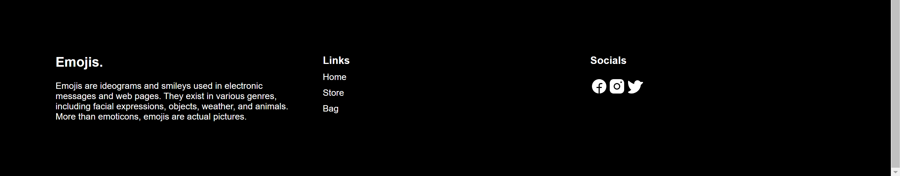
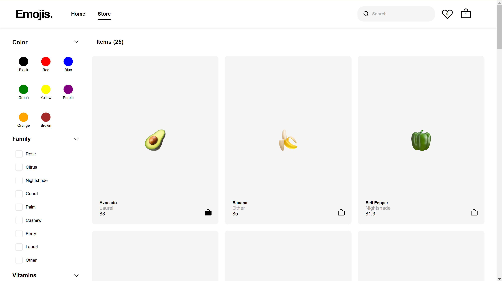
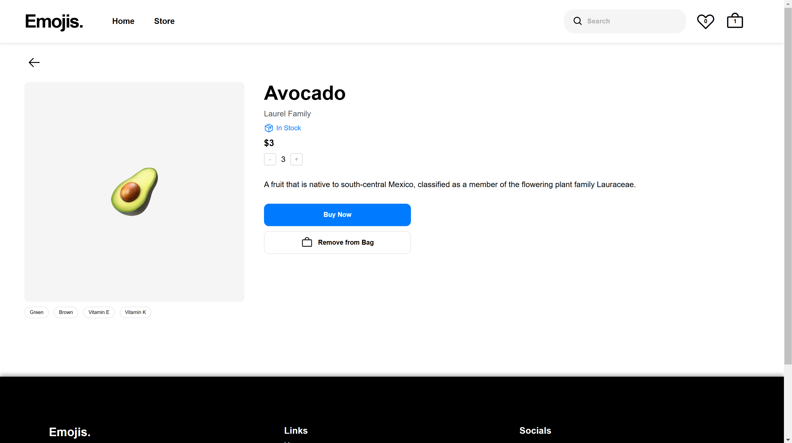
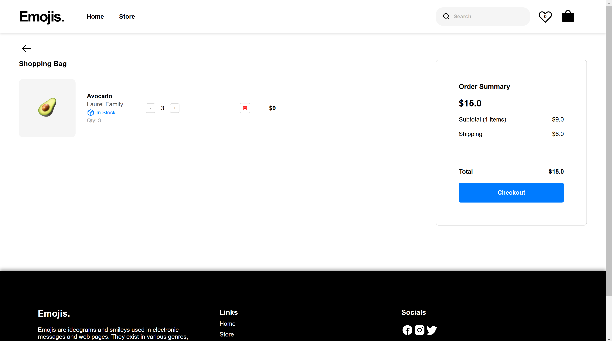

# Emoji Store  
- Emoji Store is a static e-commerce platform built with React. 
- It leverages React hooks such as Context, useEffect, and useState APIs to manage state and side effects. 
- The site offers typical e-commerce functionalities, allowing users to explore products, search for items, view product details, add items to a cart or wish list, modify their cart, and proceed through a mock checkout process. Currently, the products featured are emojis representing fruits, complete with relevant filters.

## Demo





## 👉 [Live Demo](https://fantastic-taiyaki-105532.netlify.app/)  

## Features
- **Pages:** Home, Store, Product, Cart  
- **Filtering:** Filter products by category or search query  
- **Product Actions:** Emojis can be added to the cart or to a wish list  
- **Responsive Design:** Optimized for various devices  
- **Data Management:** Local database files containing products and filter information

## Filtering Functionality
Since only fruit emojis are currently implemented as products, only the relevant filters are available:  
- Filter fruits by color, family, vitamins, favorites, or search query  
- Combine filters to narrow down results  
- Active filter tags display the current selections  
- Product listings update immediately when filters change

**Search Functionality**  
- Search for fruits by name, color, family, or vitamins  
- The search is case-insensitive and ignores extra spaces and irrelevant symbols by cleaning the query

## Tech Stack
- **Library:** React  
- **Languages:** JavaScript, HTML, CSS  
- **Build Tool:** Vite  
- **Deployment:** Netlify  
- **Dependencies:**  
  - *react-router-dom* – for routing  
  - *@phosphor-icons/react* – for icons

## Main Directories
Located in the `src` folder:  
- `assets`: Icons and images  
- `components`: React components and their CSS modules  
- `data`: Initial fruit and filter data  
- `context.jsx`: Context API provider component  
- `routes.jsx`: React router configuration  
- `main.jsx`: Entry point for the React app

## Local Setup  
To clone and run the project locally, follow these steps:

```bash
# Clone the repo
git clone https://github.com/Puthikunkim/emoji-store.git

# Navigate into the project directory
cd emoji-store

# Install dependencies
npm install

# Start the server
npm run dev
```

## Acknowledgements

